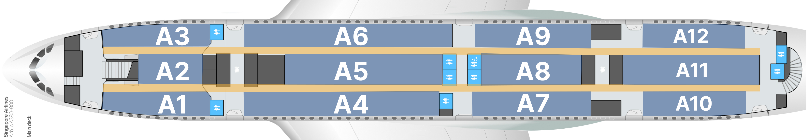
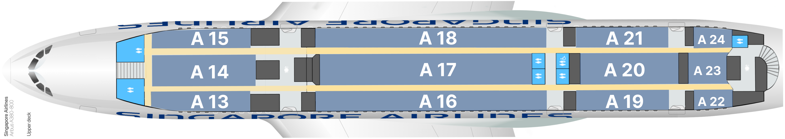
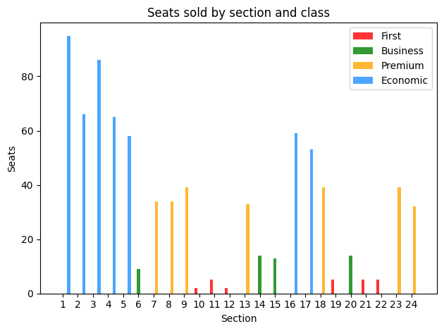
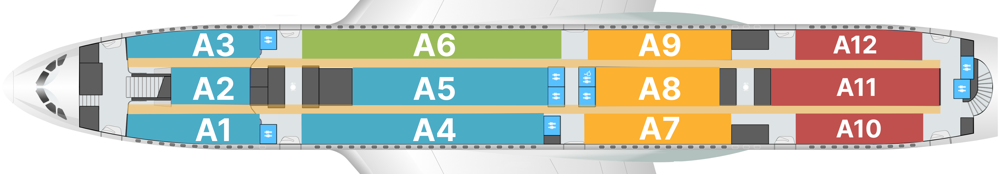
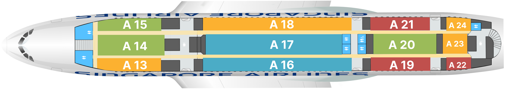

# Overview
This project aims to optimize the seating arrangement of an Airbus A380 aircraft for Singapore Airlines' flight from Singapore to London, maximizing profit while adhering to design constraints and passenger demand.

# Problem Statement
we consider the problem of finding the optimal seating arrangement for
the Airbus A380 aircraft for the SQ322 flight path from Singapore Changi Airport in
Singapore to Heathrow Airport in London. Methods such as combinatorial greedy
fill, linear programming, integer programming, and integer programming with regularization were considered and solved using Python. A mixture of seat classes using
regularization as a soft constraint for seating partitions was found to yield the best
balance of well-placed seat classes and high revenue following simulated ticket buying
trials.

# Greedy Solution
The initial idea was to sort the area from smallest to largest and sort the demand (size
of each class) weight vector based on the index of the highest profit to lowest profit.
Then, iteratively fill the area with the new demand starting from the highest cost to
lowest cost while checking the weight, area, and demand constraints. Each iteration
reduced the demand until no more seats fit based on the constraints

  

# Other Method considered (Linear Programming, Integer Programming & Regularized Integer Programming)

  

---

# References

- Airbus. (2021). Airbus Aircraft AC: A380. [Accessed: February 16, 2024]. [Link](https://www.airbus.com/sites/g/files/jlcbta136/files/2021-11/Airbus-Aircraft-AC-A380.pdf)

- Perron, L., & Furnon, V. (2024, March 7). Or-tools (Version v9.9). [Link](https://developers.google.com/optimization/)

- SeatGuru. (2024). Singapore Airlines Airbus A380 Seat Map. [Accessed: February 16, 2024]. [Link](https://www.seatguru.com/airlines/Singapore%20Air/Singapore%20Air%20Airbus%20A380%20C.php)

- Weisstein, E. W. (n.d.). Zipf distribution. [Accessed: April 20, 2024]. [Link](https://mathworld.wolfram.com/ZipfDistribution.html)

---
